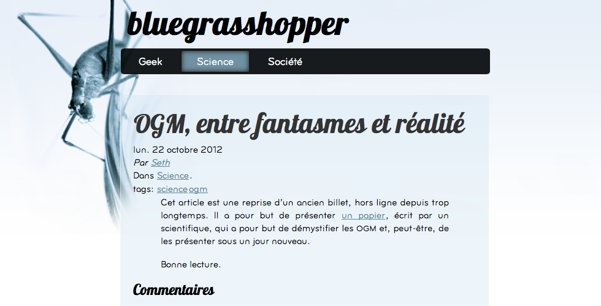

Pelican theme - Blue Grasshopper
================================

Install
-------

To publish the favicon of the theme, place the following lines in your 
pelicanconfig file:

   FILES_TO_COPY = (('pelican-bgh/static/favicon.ico', 'favicon.ico'),) 

Screenshot
----------

  

Live example
------------

Go to [my blog][bgh] to see how this theme looks like live!

  [bgh]: http://blog.gregseth.net
